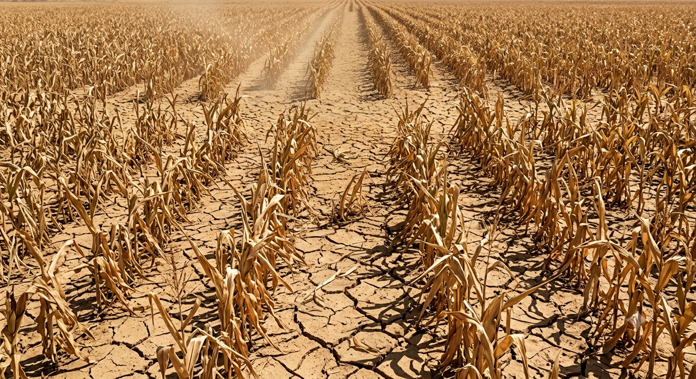
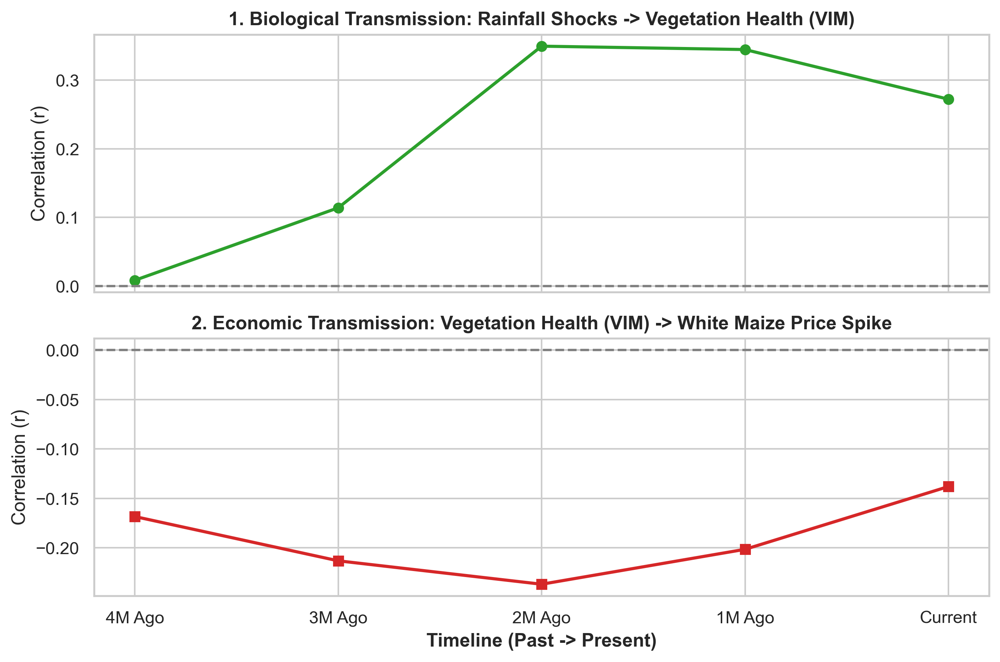
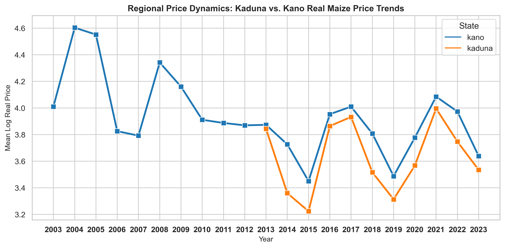
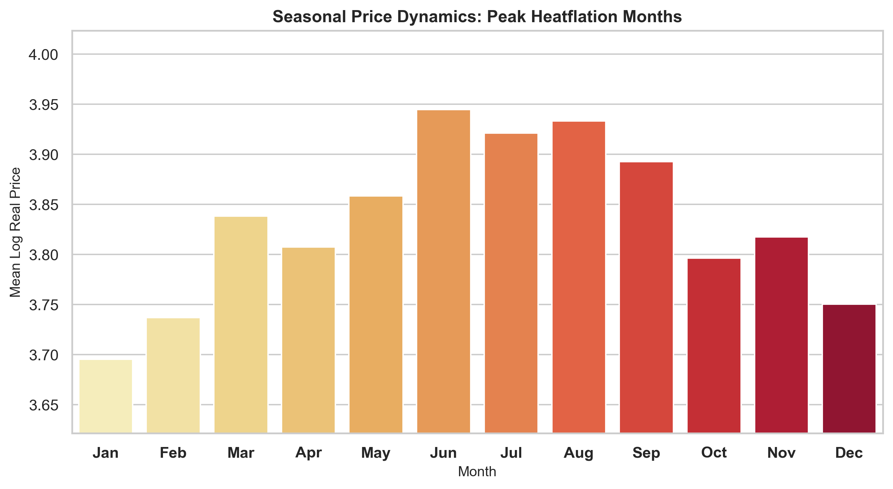
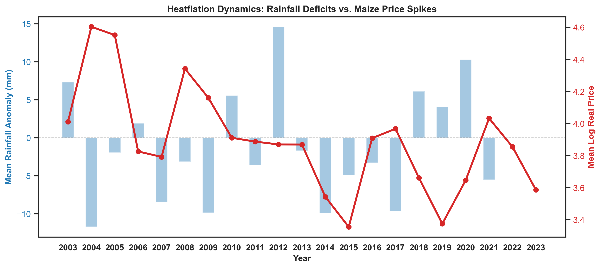
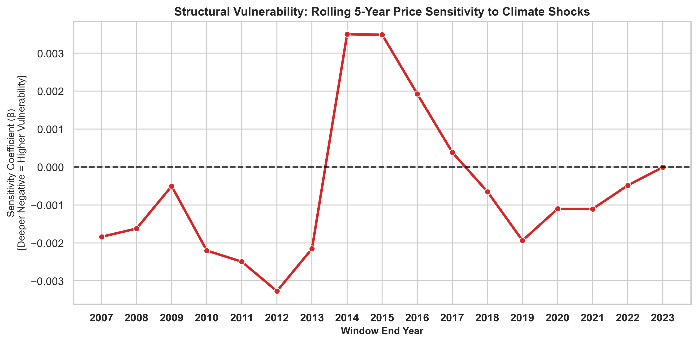

# HEATFLATION



A data engineering and analytics project leveraging SQL, Excel, and Python to model the relationship between rainfall anomalies and maize price fluctuations in Nigeria


## Heatflation Project Work flow

<br>


[ ] Phase 1: **Overview & Framework**
<details>
<summary><kbd> view phase 1 </kbd></summary>
- ### Phase 1: Overview & Framework

#### 1. What is Heatflation?
"Heatflation" is a term coined in recent economic literature to describe food price inflation driven directly by extreme weather, droughts, and climate anomalies. While general inflation in Nigeria is often linked to currency devaluation or fuel costs, heatflation specifically isolates how weather shocks disrupt crop yields and drive up food prices in local markets.

---

#### 2. Scope of the Project
* **Place (Kaduna & Kano):** These two states were selected because they serve as the primary grain production hubs and major commercial trading centers in Northern Nigeria, making them ideal representatives for regional food supply chains.
* **Timeframe & Lag:** The analysis covers monthly historical data from **2003 to 2023**. This timeline was chosen because it represents the exact temporal coverage available in our compiled dataset. Tracking 20 years of monthly data allowed us to test transmission lags—measuring how many months it takes for a rainfall deficit to travel through crop yields and ultimately hit market prices.
* **Commodity (White Maize):** White maize was chosen for four key reasons:
  1. It had the highest data reporting frequency across historical market records.
  2. It is a deeply rooted staple food consumed across households.
  3. It is highly sensitive to weather variations during critical growing stages.
  4. Its crop cycle is strictly bound to seasonal rainfall patterns.
* **Variables:**
  * **Real Price ($y_t$):** Nominal prices adjusted using the Consumer Price Index (CPI) to remove general currency inflation and isolate weather impacts.
  * **Rainfall Anomaly ($\text{RFH}_t$):** Measures deviations from long-term rainfall averages to identify drought conditions.
  * **Vegetation Anomaly ($\text{VIM}_t$):** Measures satellite-derived plant health deficits to track real-time crop stress.

---

#### 3. Goals of the Project
The primary goal of this project is to build an empirical, data-driven narrative supported by five core visual models:
1. **Biological & Economic Lags:** Map the 1-month biological delay (rain to crop health) and the 3–4 month economic delay (crop health to retail price spikes).
2. **Spatial Divergence:** Compare price insulation and market resiliency between Kaduna and Kano states.
3. **Seasonal Vulnerability:** Identify peak heatflation months ahead of harvest cycles to highlight household risk windows.
4. **Historical Price Spikes:** Track annual real price trajectories over two decades to pin down major historical shock years.
5. **Structural Vulnerability ($\beta$):** Analyze rolling 5-year price sensitivity to demonstrate how local drought impacts interact with national macroeconomic conditions over time.

---

#### 4. Problems Encountered
* **Data Sourcing & Alignment:** Merging satellite climate measurements with ground-level retail market price records required handling missing entries and harmonizing different spatial and temporal scales.
* **Data Cleaning & Standardization:** CPI metrics had to be matched across multiple base-year revisions to correctly convert nominal prices into inflation-adjusted real prices over a 20-year span.

</details>

<br>


      
- [ ] Phase 2: **Data Collection**
<details>
<summary><kbd> view phase 2 </kbd></summary>

### Phase 2: Data Collection & Assembly

We constructed a monthly panel dataset combining satellite climate metrics and macroeconomic market data across **Kaduna and Kano State**.

 The 4 Secondary Data Sources
* **Rainfall Data (CHIRPS / HDX):** Monthly rainfall totals used to calculate rainfall anomalies (`rfh_anomaly`).  
  🔗 [HDX Nigeria Subnational Rainfall Data](https://data.humdata.org/dataset/nga-rainfall-subnational)
* **Vegetation Data (MODIS / WFP Datastream):** Satellite crop health metrics (NDVI) used to calculate vegetation index margin anomalies (`vim_anomaly`).  
  🔗 [WFP VAM DataViz / Seasonal Explorer](https://dataviz.vam.wfp.org/)
* **Market Price Data (WFP VAM / HDX):** Retail white maize prices (NGN/kg) in Kaduna and Kano markets.  
  🔗 [HDX WFP Food Prices for Nigeria](https://data.humdata.org/dataset/wfp-food-prices-for-nigeria)
* **Inflation Data (Nigeria NBS):** Consumer Price Index (CPI) used to convert nominal prices into real prices.  
  🔗 [National Bureau of Statistics (NBS) CPI Reports](https://nigerianstat.gov.ng/)
 
</details>   

<br>


      
- [ ] Phase 3: **Data Cleaning** (Excel)
      
<details>
<summary><kbd> view phase 3 </kbd></summary>

   
### Data Cleaning with Excel

( *download complete raw and cleaned dataset* **[HERE](https://drive.google.com/drive/folders/1rbZ0VQx3O_sKAHD_Nkm7Jmk7rwf6XcDj?usp=drive_link)** )

Raw climate and market data contained redundant metadata, structural mismatches, and multi-market duplicates. Excel was utilized to isolate Kano and Kaduna states, standardize pricing metrics, and establish clean monthly time-series baselines.
<br>

***View the Cleaning of each data set below***


<details>
<summary><kbd> Cleaning Food Prices Dataset</kbd></summary>

<br>

**Before Cleaning (Raw Data)**


---

**After Cleaning (Processed Data)**


#### **Data Cleaning Steps Executed**
To prepare the raw market data, I used Excel to clean, filter, and organize the records using these 7 steps:

1. **Removed Unnecessary Columns:** Deleted columns that were not needed for the analysis to keep the file clean.
2. **Filtered by Location:** Filtered the data to focus only on **Kano** and **Kaduna** states.
3. **Isolated Commodity & Split Units:** Filtered for **White Maize** and separated the text and numbers in the unit column (e.g., turning "100kg" into `100` and `kg`) using this formula:
   ```excel
   =IF(L2="KG", 1, VALUE(SUBSTITUTE(L2, "KG", "")))
4. **Filtered out Retail:** Removed Retail records to focus only on Wholesale data (doing this before splitting the units would have made things more straightforward!).
5. **Split the Date:** Separated the full date column to keep only the Month and Year.
6. **Calculated Price Per KG:** Created a new column by dividing the total price by the parsed numerical unit.
7. **Aggregated with a Pivot Table:** Used a Pivot Table to average and unify the prices where different markets recorded different prices for the same state in the exact same month.

</details>

<details>
<summary><kbd> Cleaning NDVI Dataset</kbd></summary>

<br>

**Before Cleaning (Raw NDVI Data)**


---

**After Cleaning (Processed NDVI Data)**


</details>

<details>
<summary><kbd> Cleaning Rainfall Dataset</kbd></summary>

<br>

**Before Cleaning (Raw Rainfall Data)**


---

**After Cleaning (Processed Rainfall Data)**


</details>


<details>
<summary><kbd> Cleaning CPI Dataset</kbd></summary>

<br>

**Before Cleaning (Raw CPI Data)**


---

**After Cleaning (Processed CPI Data)**


</details>
</details>

<br>


- [ ] Phase 4: **Data Analysis** (SQL)
<details>
<summary><kbd> view phase 4 </kbd></summary>


**Database Architecture:** [SQL Script](./sql.sql)
</details>


<br>


- [x] Phase 5: **Pattern Recognition** (Python)
<details>
<summary><kbd> view phase 5 </kbd></summary>

### Phase 5: Pattern Recognition & Econometric Modeling

In this phase, we analyze the multi-stage transmission of rainfall anomalies to grain market price inflation using time-series econometrics and exploratory visualization.

* **Primary Notebook:** [`Heatflation_python`](./Heatflation_python.ipynb)

#### Key Empirical Analytical Steps:
1. **Database Extraction:** Querying structured time-series data directly from PostgreSQL via Pandas (`pd.read_sql_query`).
2. **Lagged Correlation Matrix:** Quantifying the two-stage transmission mechanism:
   * **Biological Transmission Lag:** Rainfall deficits ($\text{RFH}_{t-1}$) impacting vegetation health ($\text{VIM}_t$).
   * **Economic Transmission Lag:** Vegetation health shocks ($\text{VIM}_{t-3/t-4}$) driving real market price spikes ($\text{Log Real Price}_t$).
3. **Comparative Spatial & Seasonal Analysis:** Evaluating price vulnerability across Kaduna vs. Kano states and identifying seasonal peak heatflation months.
4. **Structural Vulnerability Modeling:** Estimating a 5-year rolling sensitivity coefficient ($\beta$) to measure evolving market susceptibility to climate shocks over time.

</details>


<br>


 
- [ ] Phase 6: **Data Visualization**
<details>
<summary><kbd> view phase 6 </kbd></summary>

 ### Phase 6: Data Visualization & Policy Insights

This phase translates our quantitative findings into publication-ready visual models that map the transmission mechanism, regional divergence, and evolving market vulnerability.

* **Primary Notebook:** [`Heatflation_python.ipynb`](./Heatflation_python.ipynb)

#### Core Visualizations:
#### 1. Biological and Economic Transmission Lags

* **Biological Transmission Buffer:** A 1-month delay occurs between rainfall deficits ($\text{RFH}_{t-1}$) and observable crop health decline ($\text{VIM}_t$).
* **Economic Transmission Buffer:** A 3–4 month delay occurs between crop stress ($\text{VIM}_{t-3/t-4}$) and retail white maize price spikes ($\text{Log Real Price}_t$).

#### 2. Spatial Market Divergence (State-Level Analysis)

* Highlights regional price dispersion, contrasting market insulation and supply chain resiliency between major agricultural hubs (e.g., Kaduna vs. Kano).

#### 3. Seasonal Heatflation Profile

* Pinpoints peak heatflation months to show when household purchasing power is most severely impacted ahead of harvest periods.

### 4. Long-Term Yearly Price Spikes

* Illustrates historical year-over-year real price volatility and highlights major drought-driven price spike years across the two-decade sample period.

#### 5. Structural Vulnerability Trajectory ($\beta$)

* **Non-Linear Transmission:** Dips below zero mark periods where local drought shocks directly drove food inflation. Spikes above zero reflect periods where national macroeconomic shocks overwhelmed local climate signals.


</details>

<br>


<details>
<summary> Conclusion </summary>
</details>


<details>
<summary> Reference </summary>
</details>


      
